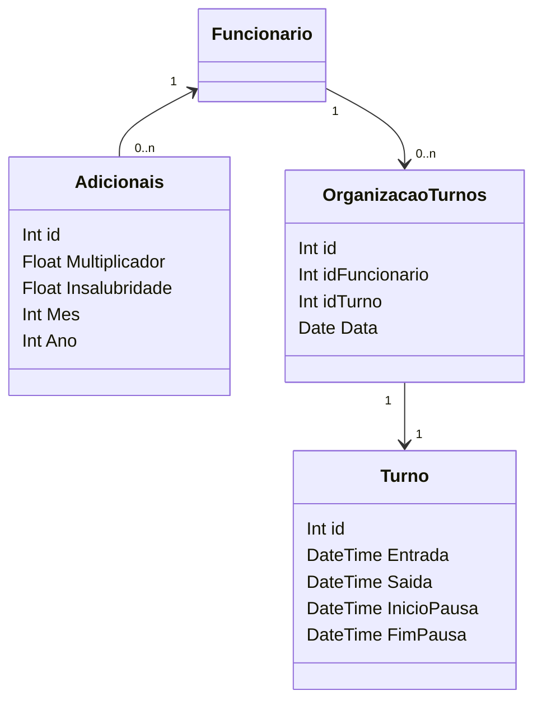

### Turnos e Adicionais

**Adicionais** armazena informações sobre valores adicionais ao salário do funcionário

**OrganizacaoTurnos** e **Turno** permitem a organização dos turnos de trabalho dos funcionários.

::right::

