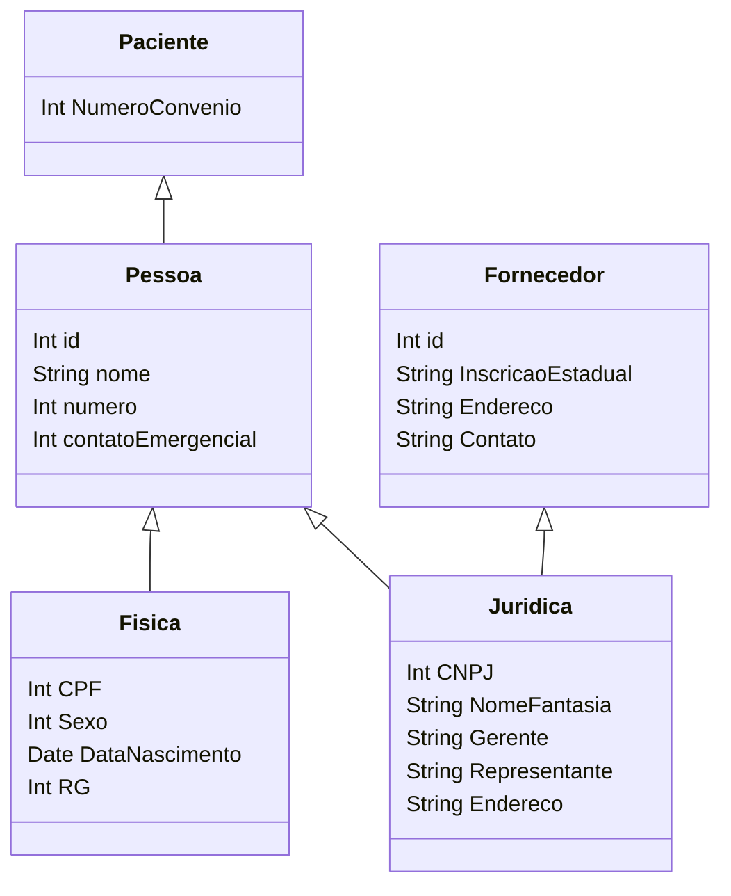

### Classe Pessoa

**Pessoa** é uma classe base que representa informações gerais de uma pessoa, como ID, nome, número e contato de emergência.

**Paciente** é uma classe que herda de Pessoa e adiciona informações específicas de um paciente, como número de convênio.

**Fisica** e **Juridica** são subclasses de Pessoa que representam pessoas físicas e jurídicas, respectivamente, cada uma com atributos específicos, como CPF para Fisica e CNPJ para Juridica.

**Fornecedor** é uma classe que herda de **Juridica** e representa informações sobre fornecedores, incluindo inscrição estadual e detalhes de contato.

::right::

