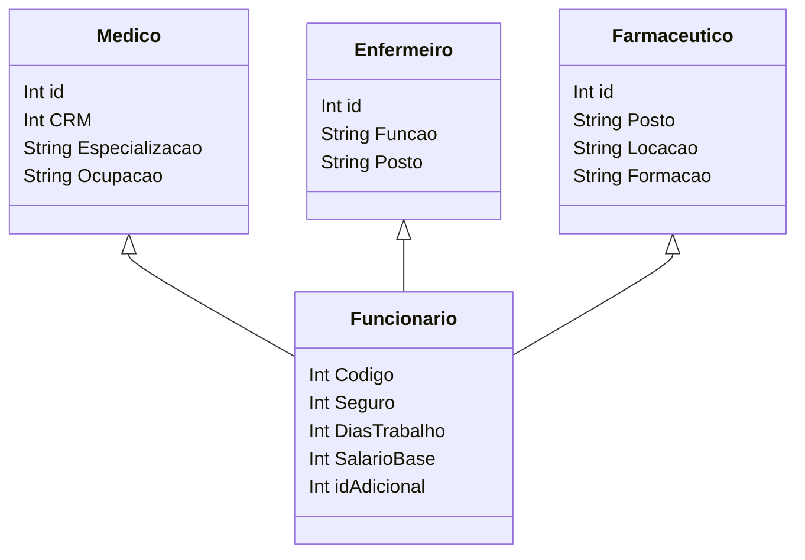

### Classe Funcionário

**Medico**, **Enfermeiro**, e **Farmaceutico** são subclasses de **Funcionario** que representam diferentes tipos de profissionais de saúde, cada um com atributos específicos, como CRM para Médico e Função para Enfermeiro.

**Funcionario** é uma classe que herda de **Pessoa** e representa informações sobre os funcionários, incluindo código, seguro, dias de trabalho, salário base, entre outros.

::right::

