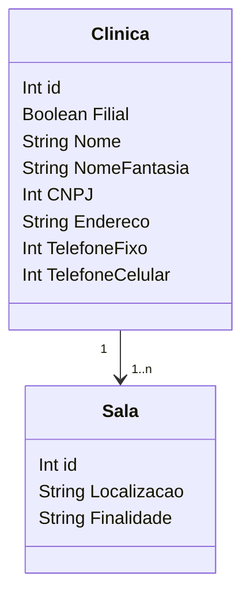

### Ambientes

**Sala** representa salas onde consultas e procedimentos podem ocorrer, com informações como ID, localização e finalidade.

**Clinica** representa informações sobre clínicas médicas, incluindo nome, CNPJ, endereço e detalhes de contato.

::right::

