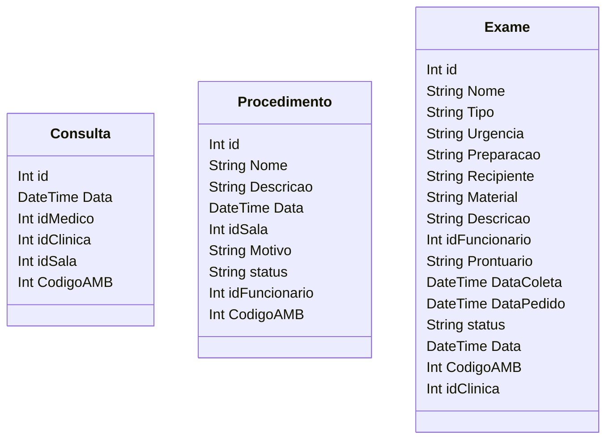

### Serviços

**Procedimento** é uma classe que descreve procedimentos médicos, com atributos como nome, descrição, data e status.

**Consulta** representa informações sobre consultas médicas, incluindo data, médico responsável e clínica onde ocorre.

**Exame** representa informações sobre exames médicos, incluindo nome, tipo, urgência, preparação e outros detalhes.

::right::

