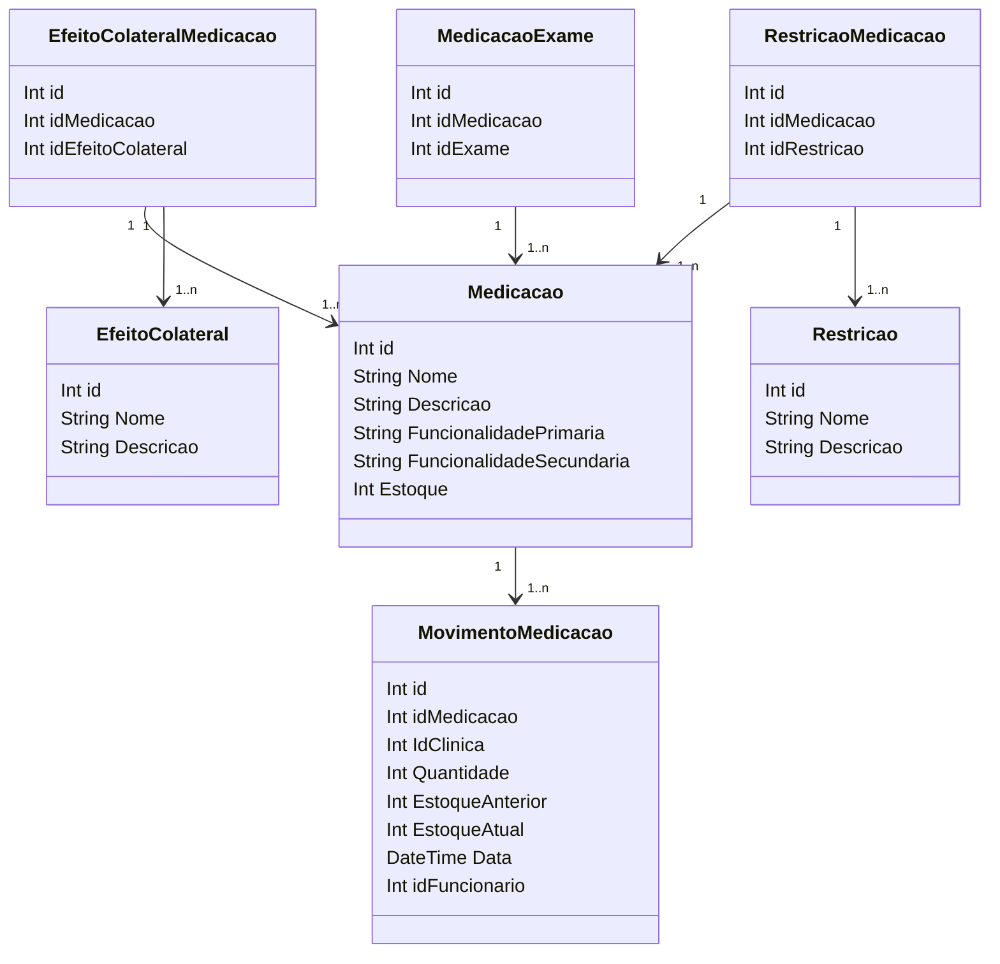

### Medicação

**Medicacao** descreve medicamentos disponíveis, com informações como nome, estoque e funcionalidades.

**EfeitoColateralMedicacao** e **RestricaoMedicacao** associam medicamentos a efeitos colaterais e restrições.

**MovimentoMedicacao** rastreia o movimento de medicamentos, incluindo informações sobre estoque e datas.

**MedicacaoExame** conecta medicamentos a exames médicos, possibilitando a administração adequada de medicamentos antes de um exame.

::right::

