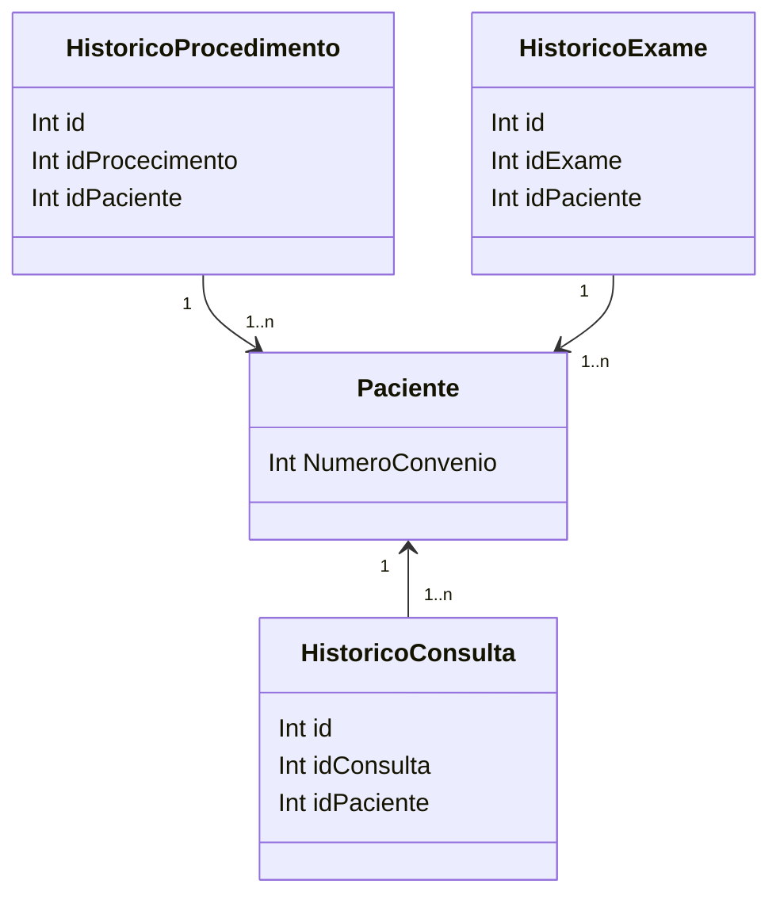

### Histórico

**HistoricoConsulta** e **HistoricoProcedimento** relacionam pacientes a consultas e procedimentos, permitindo o rastreamento de histórico médico.

**HistoricoExame** associa pacientes a exames médicos, permitindo o registro de histórico de exames.

::right::

