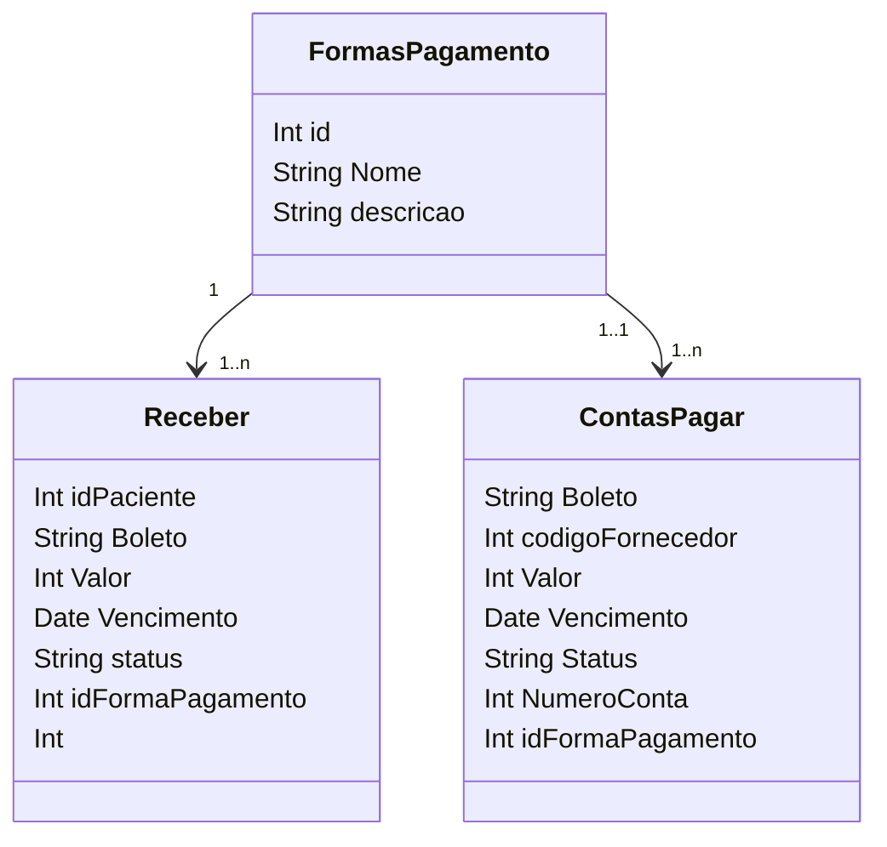

### Pagamentos

**Receber** e **ContasPagar** representam informações de pagamentos, incluindo dados sobre pacientes e fornecedores, formas de pagamento e valores.

**FormasPagamento** representa as formas de pagamento utilizadas no sistema.

::right::

