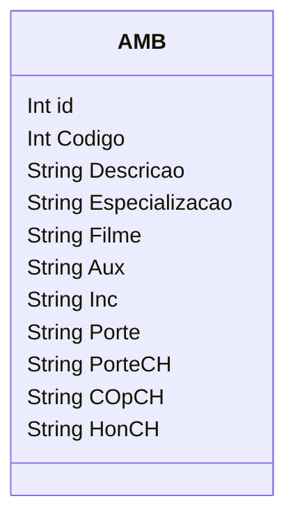

### AMB

**AMB** representa a Classificação Brasileira Hierarquizada de Procedimentos Médicos (AMB), com informações detalhadas sobre procedimentos médicos.

::right::

```mermaid
classDiagram
    class AMB {
        Int id
        Int Codigo
        String Descricao
        String Especializacao
        String Filme
        String Aux
        String Inc
        String Porte
        String PorteCH
        String COpCH
        String HonCH
    }
```